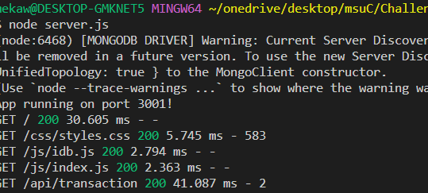

# Budget Tracker

## Purpose
This project is designed give the user the ability to track their budget without an internet connection, and then get a notification when the transactions are added to the budget when the user is back online. This online/offlline functionality will help the user keep track of their finances.

## Built With
- MongoDB
- Mongoose
- Express
- MongoDB Atlas

## Link to Deployed Application
[Link] ()

## Screenshot
